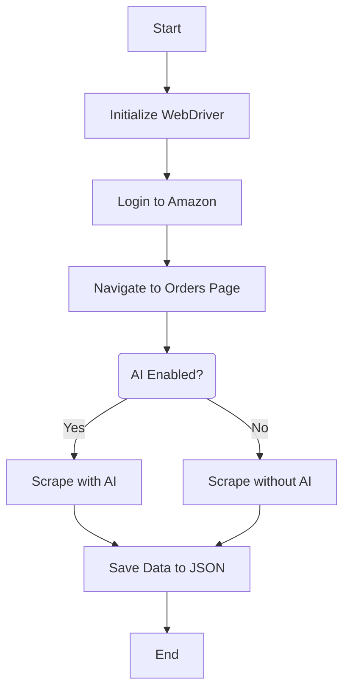
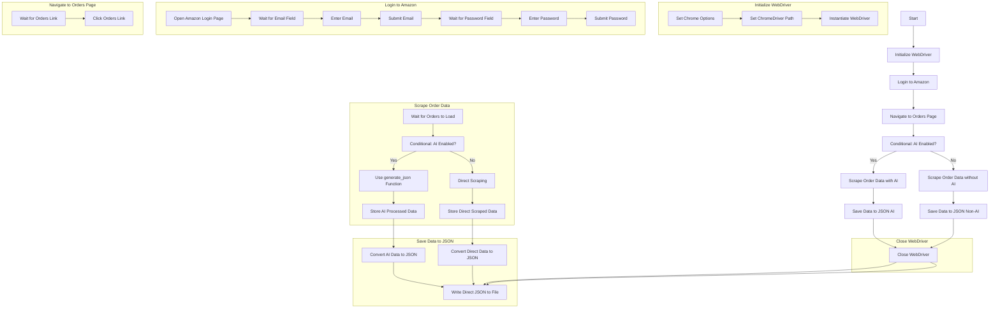

### Document for Scraping Amazon Data with Selenium and AI Integration

### Overview

The Amazon Order Scraper script automates the process of logging into an Amazon account, navigating to the orders page, and scraping order details. The data is then saved into JSON files. The script includes an AI component to structure the scraped data into a more detailed and organized JSON format using the `mistral` model from the `ollama` library.

### Running the Amazon Order Scraper Project with Ollama

#### Prerequisites

1. **Python**: Ensure Python 3.x is installed on your system. You can download it from [python.org](https://www.python.org/downloads/).

2. **ChromeDriver**: Download ChromeDriver from [chromedriver.chromium.org](https://chromedriver.chromium.org/downloads) and place it in a directory (e.g., `./chromedriver`) accessible to your script.

3. **Environment Variables**: Set up environment variables for your Amazon account credentials:
   - `AMAZON_USERNAME`: Your Amazon account email (base64 encoded).
   - `AMAZON_PASSWORD`: Your Amazon account password (base64 encoded).

4. **Ollama Setup**: Install `ollama` and download the `mistral` model using `ollama pull`.

   ```bash
   pip install ollama
   ollama pull mistral
   ```

   - This command installs `ollama` library and downloads the `mistral` model necessary for AI-based JSON generation.

#### Setting Up the Project

1. **Install Dependencies**: Install the required Python dependencies using `pip`. It's recommended to use a virtual environment to manage dependencies.

   ```bash
   pip install -r requirements.txt
   ```

#### Running the Script

2. **Run the Script**: Execute the main script `scraper.py`.

   ```bash
   python main.py --enable-ai
   ```

   - Use the `--enable-ai` flag to enable the AI-based JSON generation for scraped data.
   - Omit the flag (`python scraper.py`) to perform normal scraping without AI.

#### Output

4. **Check Output Files**: After execution, check the generated JSON files:
   - `orders_ai.json`: Contains structured order data if AI processing was enabled.
   - `orders_non_ai.json`: Contains unstructured order data if AI processing was disabled.


### Components

1. **Configuration Section**
   - **chrome_driver_path**: Path to the ChromeDriver executable.
   - **amazon_username**: Amazon account email (base64 encoded, retrieved from environment variables).
   - **amazon_password**: Amazon account password (base64 encoded, retrieved from environment variables).
   - **Secure Credential Management**:
        - Environment Variables and Base64 Encoding:
          - To enhance the security of your Amazon credentials, the script uses environment variables and Base64 encoding. This approach helps to avoid hardcoding sensitive information directly in the script.

2. **WebDriver Initialization**
   - Sets up the Selenium WebDriver with Chrome options.

3. **Functions**
   - `decode_credentials(encoded_username, encoded_password)`: Decodes base64 encoded credentials.
   - `setup_driver()`: Sets up the Selenium WebDriver.
   - `handle_alerts(driver)`: Handles any unexpected popups or alerts.
   - `login_amazon(driver, username, password)`: Logs into Amazon using the provided credentials.
   - `navigate_to_orders(driver)`: Navigates to the orders page after logging in.
   - `scrape_order_data(driver, enable_ai)`: Scrapes order details from the orders page. Uses AI if enabled.

4. **AI Integration**
   - **generate_json(html_content)**: Converts HTML content to structured JSON using the `mistral` model from `ollama`.

5. **Main Script Execution**
   - Orchestrates the login, navigation, scraping, AI processing, and saving of data into JSON files.

### Flow Diagram



### Detailed Explanation

1. **Initialize WebDriver**
   - Sets Chrome options (e.g., maximized window).
   - Specifies the path to ChromeDriver.
   - Instantiates the WebDriver.

2. **Login to Amazon**
   - Opens the Amazon login page.
   - Waits for the email input field to be present.
   - Enters the username and submits the form.
   - Waits for the password input field to be present.
   - Enters the password and submits the form.
   - Handles any unexpected popups or alerts.

3. **Navigate to Orders Page**
   - Waits for the orders link to be present.
   - Clicks on the orders link to navigate to the orders page.
   - Handles any unexpected popups or alerts.

4. **Scrape Order Data**
   - Waits for the orders to be loaded.
   - Depending on the `enable_ai` flag:
     - If `True`, uses `generate_json` to convert HTML content to structured JSON using the `mistral` model from `ollama`.
     - If `False`, extracts order details directly.
   - Stores the extracted data in a list of dictionaries.

5. **Save Data to JSON**
   - Converts the list of dictionaries to a JSON string.
   - Writes the JSON string to a file named `orders_non_ai.json` if AI is disabled, or `orders_ai.json` if AI is enabled.

6. **Close WebDriver**
   - Ensures the WebDriver is closed properly to free resources.

### Detailed Flow Diagram



### AI Integration Details

The AI integration component utilizes the `ollama` library with the `mistral` model to convert HTML content of each order into a structured JSON format. This enhancement allows for more detailed and organized data extraction, improving the accuracy and usefulness of the scraped data.